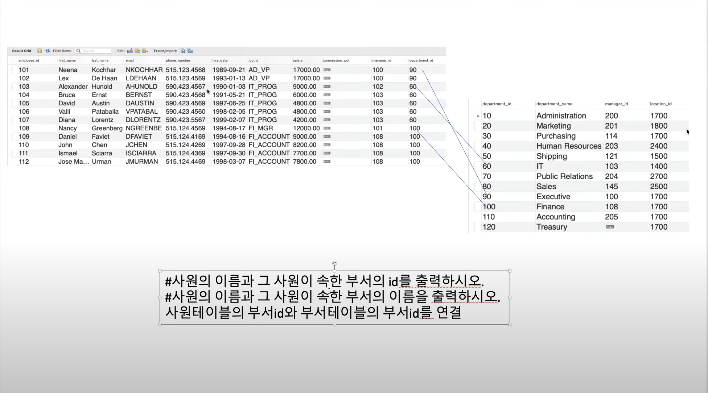

 ## 크롬 개발자 도구

- 네트워크 보기

---

---

 ## http://localhost:8080

- http://localhost:8080/

1) 브라우저는 서버에 접속
   2) 요청 정보를 보낸다
            
            Get/
            헤더들
            빈줄

           - GET : 요청메소드

---

3) Tomcat는 / 에 해당하는 요청은 index.jsp가 기본으로 설정되어 있어 읽어들여 응답

            200 OK
            응답헤더들
            빈줄
            index.jsp의 내용

---

 ## 서블릿이란?

 - HttpServlet을 상속받는 클래스를 말한다. <- Http요청을 처리해주는 클래스가 HttpServlet이다.
 - JSP도 특수한 형태의 서블릿이라고 말할 수 있다.

---

 ## 서블릿을 실행

http://localhost:8080/hello-servlet

@WebServlet(name = "helloServlet", value = "/hello-servlet")

---

---

 ## Tomcat은?

/hello-servlet 에 해당하는 서블릿을 찾아서 실행.

HelloServlet을 실행

 Get방식으로 요청했기 때문에 HelloServlet의 doGet을 Tomcat이 실행.

---

 ## IntelliJ로 프로젝트를 생성하면 자동으로 만들어주는 Servlet이 있다.

    package com.example.servletexam;

    import java.io.*;
    import javax.servlet.http.*;
    import javax.servlet.annotation.*;

    @WebServlet(name = "helloServlet", value = "/hello-servlet")
    public class HelloServlet extends HttpServlet {
      private String message;

      public void init() {
        message = "Hello World!";
      }

      public void doGet(HttpServletRequest request, HttpServletResponse response) throws IOException {
        response.setContentType("text/html");

        // Hello
        PrintWriter out = response.getWriter();
        out.println("<html><body>");
        out.println("<h1>" + message + "</h1>");
        out.println("</body></html>");
      }

      public void destroy() {
      }
    }

---

---

 ## HttpServlet의 동작 원리.

 - Tomcat이 요청을 받아서, 어떤 서블릿을 실행하는가?
 - Tomcat은 요청정보를 HttpServletRequest, 응답을 위해 HttpServletResponse인스턴스를 생성
 - Tomcat은 서블릿의 doGet메소드의 인자로 위의 객체를 전달하여 실행해달라고 한다.

 - Servlet 코드

         - 요청정보로부터 브라우저가 보내주는 값을 읽어들인다.
         - 원하는 코드를 작성
         - 그 결과를 응답에게 써준다. (PrintWriter)

---

 ## 스프링 웹 프로그래밍

- 가장 핵심이 되는 클래스
      DispatcherServlet

---

---

 ## Plus Form

- http://localhost:8080/
   - / ==> /index.jsp를 요청하는 것과 같다.
   - http://localhost:8080/index.jsp

---

 ## Plus Form
webapp/index.jsp  ---> webapp/form/index.jsp로 옮겼다.

http://localhost:8080/form/
http://localhost:8080/form/index.jsp

---

 ## Plus Form

 - submit을 하면
    - http://localhost:8080/form/plus?x=20&y=40
 - action="plus" 상대경로 plus
    - http://localhost:8080/form/ + plus
    - http://localhost:8080/plus <-- 원래 이게 호출되어야함.

            <form method="get" action="plus">
                x : <input type="text" name="x"> 
                y : <input type="text" name="y"> 
                <input type="submit" value="plus">
            </form>

get방식으로 action에 있는 곳으로 전달하라는 뜻

---

- submit을 하면
    - http://localhost:8080/form/plus?x=20&y=40
- action="/plus" 절대경로 plus
    - http://localhost:8080 + /plus
    - http://localhost:8080/plus <-- 원래 이게 호출되어야함.

            <form method="get" action="/plus">
                x : <input type="text" name="x"> 
                y : <input type="text" name="y"> 
                <input type="submit" value="plus">
            </form>

---

---

 ## 서블릿에서 서블릿 인스턴스를 생성하는 것은 누구일까?

    Book b1 = new Book();

    - Tomcat 이라는 WAS가 인스턴스를 생성
    - /hello 요청을 받으면, 해당 PATH를 처리하는 서블릿이 메모리에 있느냐?
        HelloServlet hello = new HelloServlet();
        hello.init();
    - 메모리에 있다면 
        hello.service(req, resp);
            hello.doGet(req, resp);

---

 ## Spring 프레임 워크에서 Bean?

 - Spring 컨테이너가 관리하는 객체(인스턴스)

---

- 즉 요약하자면 서블릿은 Tomcat이 관리하는 객체이고 Bean은 스프링이 관리하는 객체이다.
- 우리를 대신하여 인스턴스를 생성하고 라이프사이클을 관리해주는 것이다.

---

 ## Spring으로 웹어플리케이션을 만들기
 
war 파일 ----> Tomcat서버 배포 (servlet, jsp라이브러리)

    ------ WEB-INF --- classes 
                    --- 개발자가 만든 package, calss들(spring설정class)
                --- lib --- spring과 관련된 각종jar파일(외부 라이브러리 파일)
                --- web.xml -> java.config(버전이 올라감에따라)
                --- 각종 리소스, hello.png // 즉 포워딩하는 경로로는 접근할 수 있다.
    ------ 각종 이미지, jsp, logo.png

http://localhost:8080/logo.png 바로 접근이 가능하지만.

WEB-INF 폴더 밑에 있는 리소스는
http://localhost:8080/WEB-INF/hello.png 이거는 접근할 수 없다.

---

 ## 스프링 설정 파일을 작성한다.

- 스프링 설정을 읽어들이는 것은 ApplicationContext (스프링 컨테이너)
- Tomcat은 web.xml파일 이나 Servlet 관련 파일들을 이해하고 실행하기 때문이다.

    @Configuration // Spring Java Config를 알려주는것.
    @EnableWebMvc // <mvc:annotation-driven /> <- xml 태그에선 이렇게 쓰여진다.
    public class WebConfig implements WebMvcConfigurer {
    public WebConfig() {
        System.out.println("WebConfig가 실행됩니다.");
        }
    }

---

 ## Tomcat 설정 파일

 - web ---> Java Config
    - Tomcat이 읽어들이는 Java Config에서 스프링 설정을 읽어들이도록 한다.
    - ApplicationContext가 읽어들이도록 한다.
    - 스프링이 제공하는 WebApplicationInitializer를 구현한 클래스를 만들고 onStartup을 오버라이딩하면, Tomcat이 실행되면서 자동으로 실행한다.
    - Tomcat이 실행될때 자동으로 읽어들이는 파일들은 스프링 jar파일에서 제공한다.
        - 자동으로 제공하는 클래스가 WebApplicationInitializer를 구현하고 있는 클래스를 실행하게 된다.

---

 ## Spring MVC의 핵심 서블릿

 - DispatcherServlet

               /hello                   /hello경로가 붙어있는 서블릿
        브라우저 ---------> Tomcat -----> 서블릿 , 정적파일(img.png, html, ....)

               /hello                         / (단일진입점)
        브라우저 ---------> Tomcat -----> 서블릿(DispatcherServlet) ---> ApplicationContext ---> Bean( Controller("/hello") )

가장 중요한 차이는 서블릿은 Tomcat이 관리하는건데  Bean은 스프링 컨테이너가 관리하기 때문에 다양한 작업을 수행해 줄 수 있다.

---

 ## 이미지를 호출한다.

 http://localhost:8080 + Context Path(우린 /로 설정) + PATH (/img.png) ? 파라미터들

 내 컴퓨터의 8080 서버에 접속.

---

 ## 이미지와 JSP를 호출

 http://localhost:8080/i mg.png
 http://localhost:8080/hello.jsp

             /img.png                        / (단일진입점)

        브라우저 ---------> Tomcat -----> 서블릿(DispatcherServlet) ---> ApplicationContext ---> Bean( Controller("/img.png") )
                                                                                                  지금 이게 없으니까 404오류가 뜨는 것이다.

             /img.png                        / (단일진입점)

        브라우저 ---------> Tomcat -----> 서블릿(DispatcherServlet) ---> ApplicationContext ---> Bean( Controller("/...") )
                                                                 ----> Tomcat의 DefaultServlet ---> /webapp/img.png                                 

하지만 Webconfig에서 configureDefaultServletHandling로 디폴트 서블릿을 추가해준다면 Controller("...")가 없으면 Tomcat의 DefaultServlet이 /img.png를 읽어들인다.

             /hello.jsp                        / (단일진입점)

        브라우저 ---------> Tomcat -----> 서블릿(DispatcherServlet) ---> ApplicationContext ---> Bean( Controller("/...) )
                                                                 ----> Tomcat의 DefaultServlet ---> /hello.jsp           
---

 ## JSP의 단점

 - Java 코드가 실행된다. - 유지보수 X, 보안 X
 - JSP = HTML + CSS가 섞여있다. ( 퍼블리셔, 프론트개발자 ) <- 자바코드가 섞여있어서 이 사람들이 처리하기도 곤란하고 보안에도 취약
 - JSP는 최대한 Java코드를 줄인다.
 - 결과는 Servlet or Controller에서 만들고 JSP에게 결과를 전달한다.

---

 ## Spring MVC는 여러개의 ViewResolver를 가질 수 있다.

 - 스프링 컨테이너는 ViewResolver인터페이스를 구현하고 있는 Bean이 어떤 것들이 있는지 알 고 있다.
 - ViewResolver인터페이스를 구현하는 Bean을 가질 수 있다.
 - 이 사용자는 JSP를 사용하도록 설정하고 있다(Tomcat사용, build.gradle에서 JSP 설정). 그런데 Bean중에 InternalResourceViewResolver가 있다고?
 - 그러면 컨트롤러가 리턴하는 문자열을 InternalResourceViewResolver가 동작하도록 한다.
 - Servlet or Controller 로부터 포워딩 될 경우 사용

            /hello                        / (단일진입점)

        브라우저 ---------> Tomcat -----> 서블릿(DispatcherServlet) ---> ApplicationContext ---> Bean( Controller("/hello") ) 
                                                                            -- 컨트롤러가 값을 리턴 --> InternalResourceViewResolver가 동작하며
                                                                                                        /WEB-INF/view/hello.jsp 포워딩을 한다. 

---

 ## /WEB-INF 폴더는 외부에서 접근할 수 없다.

 - /WEB-INF는 서버 내부에서 포워딩 할 수 있다.

 /WEB-INF/view/hello.jsp
 
 http://localhost:8080/WEB-INF/view/hello.jsp -> 404오류 (접근불가)
 
---

 ## Controller 와 ViewResolver

 - Controller는 로직을 수행하여 결과를 만들어 낸다. ---> InternalResourceViewResolver ---> JSP는 결과를 출력만하도록 하자.
 - Controller는 로직을 수행하여 결과를 만들어 낸다. ------>    BeanNameViewResolver   ------> Excel파일을 다운로드 할 수 있다.

 다양한 ViewResolver가 있다. 종류마다 조건이 다양하다.
 
---

DBMS안에는 여러개의 Database가 있을 수 있다.
Database는 특정 사용자만 이용할 수 있다. 특정 사용자는 DBMS에서 관리되는 사용자를 말한다.
Database안에는 Table을 생성한다. 회원정보는 회원Table에 저장, 상품정보는 상품Table에 저장

---

1. 내 컴퓨터에 DBMS를 설치한다. (첫번째 시간을 보면 Docker Desktop을 이용해서 MySQL을 실행한다.)
2. Database를 생성
3. Database를 이용하는 사용자 생성, 권한 부여
4. Database에 여러 Table을 생성, 해당 Table에 값을 저장한다.

---

Database 프로그래밍

1. SQL - SQL성능이 안나오면 실행계획을 볼 줄 알아야 한다. (튜닝)
2. SQL을 이용해서 JDBC 프로그래밍 (데이터베이스 프로그래밍)
3. Spring JDBC
4. Spring Data JPA(ORM기술) - 직접 SQL을 사용하지 않아도 된다. (내부적으로 SQL을 생성하여 동작) - 어떤 SQL을 생성할 것인지를 예상할 수 있어야 한다.

---

브라우저 ----- /hello ------> Tomcat --/ (모든요청) --> DispatcherServlet ---> Controller("/hello") --> 결과 ---> JSP

Controller의 메소드
http요청, http응답 <- Controller가 하는 가장 중요한 일
------------------

하나의 컨트롤러는 여러개의 Service를 사용해서 어떤 결과를 만들어 낼 수 있다.

                Service
                비즈니스 로직을 수행
                - 이자계산, 어떤 특정 사용자가 주문한 상품의 전체 가격을 구한다.
                - 트랜잭션(Transaction)
                    - 여러개의 DAO or Repository를 하나의 논리적인 작업단위로 실행할 수 있어야 한다.

                                     DAO (Data Access Object), Repository - Data를 다루기 위한 객체
                                JDBC프로그래밍을 좀 더 간결하게 하는 방법 -> 여러가지 중 대표적인것: Spring JDBC, Spring Data JPA(ORM기술), MyBatis
                                데이터베이스 프로그래밍(JDBC 프로그래밍)  -- SQL ------>   DBMS (Database를 관리) - MySQL

- DTO (Data Transfer Object) - 레이어를 넘나드는 객체
- 브라우저 ----- /hello ------> Tomcat --/ (모든요청) --> DispatcherServlet ---> Controller("/hello") --> 결과 ---> JSP

Controller의 메소드
http요청, http응답 <- Controller가 하는 가장 중요한 일
------------------
하나의 컨트롤러는 여러개의 Service를 사용해서 어떤 결과를 만들어 낼 수 있다.

                Service
                비즈니스 로직을 수행
                - 이자계산, 어떤 특정 사용자가 주문한 상품의 전체 가격을 구한다.
                - 트랜잭션(Transaction)
                    - 여러개의 DAO or Repository를 하나의 논리적인 작업단위로 실행할 수 있어야 한다.

                                     DAO (Data Access Object), Repository - Data를 다루기 위한 객체
                                JDBC프로그래밍을 좀 더 간결하게 하는 방법 -> 여러가지 중 대표적인것: Spring JDBC, Spring Data JPA(ORM기술), MyBatis
                                데이터베이스 프로그래밍(JDBC 프로그래밍)  -- SQL ------>   DBMS (Database를 관리) - MySQL

- DTO (Data Transfer Object) - 레이어를 넘나드는 객체
  

DBMS안에는 여러개의 Database가 있을 수 있다.
Database는 특정 사용자만 이용할 수 있다. 특정 사용자는 DBMS에서 관리되는 사용자를 말한다.
Database안에는 Table을 생성한다. 회원정보는 회원Table에 저장, 상품정보는 상품Table에 저장

---

1. 내 컴퓨터에 DBMS를 설치한다. (첫번째 시간을 보면 Docker Desktop을 이용해서 MySQL을 실행한다.)
2. Database를 생성
3. Database를 이용하는 사용자 생성, 권한 부여
4. Database에 여러 Table을 생성, 해당 Table에 값을 저장한다.

---

Database 프로그래밍

1. SQL - SQL성능이 안나오면 실행계획을 볼 줄 알아야 한다. (튜닝)
2. SQL을 이용해서 JDBC 프로그래밍 (데이터베이스 프로그래밍)
3. Spring JDBC
4. Spring Data JPA(ORM기술) - 직접 SQL을 사용하지 않아도 된다. (내부적으로 SQL을 생성하여 동작) - 어떤 SQL을 생성할 것인지를 예상할 수 있어야 한다.

---

---

DB에 계속 연결하고 끊어지면 시간이 오래 걸리니까 DBMS랑 미리 연결한 객체를 많이 만든 것이다. -> 커넥션 객체
커넥션 풀은 미리 커넥션을 연결해놓고 빌려온걸 끊는게 아니라 되돌려주는 매커니즘이다. -> 성능이 좋아진다.

---

Persistence Context(영속성 관리자)
 

엔티티는 하나지만 엔티티 매니저는 여러개가 존재한다. <- 쓰레드에 안전해야 하기 때문에 여러개 있어야함. 즉 필요할때 매니저를 만들어서 사용한다. -> EntityManagerFactory
Entity, Persistence Context, Entity Manager, JPA Exception, Transaction <- 중요한 단어들
이것들을 다 하나로 묶어서 편하게 사용하게 해주는 것이 Spring Data JPA입니다.

--- 

---

## JSP에서 JSTL을 사용

    <%@ taglib prefix="c" uri="http://java.sun.com/jsp/jstl/core" %>
    taglib설정을 한다. jstl core라이브러리의 약자인 c를 네임스페이스로 사용한다.

        List<ToDo> toDoList =  toDoService.getToDoList();
        model.addAttribute("toDoList", toDoList);
    위와 같이 컨트롤러가 값을 담아서 보냈다.
    이때 items에는 model.addAttribute에 넣은 key값.
    <c:forEach var="todo" items="${toDoList}" varStatus="status">
        
${todo.todo}"/>
 // EL 표기법 todo가 참조하는 객체의 todo프로퍼티(getTodo())를 사용한다.
    </c:forEach>

---

브라우저 ------------- http://localhost/todos/list -------> ToDoController.list() 결과 ------------> list.jsp
        <-----------------------------------------------------------------------------------------

사용자가 할일을 입력, 버튼 클릭   -------Post방식 /todos/addToDo ----->              ToDoController.addToDo (값을 저장)
        <---------------------- 상태코드 301, location응답해더 /todos/list -------

자동요청  ------------- http://localhost/todos/list -------> ToDoController.list() 결과 ------------> list.jsp
        <-----------------------------------------------------------------------------------------

---

## Database vs DBMS

Database와 DBMS를 어린이에게 설명하시오.
아이들이 보는 책       --------> Database
책들을 관리하는 분 - 엄마 ------> DBMS

---

## Database

- 데이터의 집합
- 여러 응용 시스템(프로그램)들의 통합된 정보들을 저장하여 운영할 수 있는 공용 데이터의 집합
- 효율적으로 저장, 검색, 갱신할 수 있도록 데이터 집합들끼리 연관시키고 조직화되어야 한다.

---

## 데이터베이스의 특성

- 실시간 접근성
- 계속적인 변화
- 동시 공유성
- 내용 참조

---

## 데이터 베이스 관리 시스템(DBMS)

- 데이터베이스를 관리하는 소프트웨어
- 여러 응용 소프트웨어 또는 시스템이 동시에 데이터베이스에 접근하여 사용할 수 있게 한다.
- Oracle,SQL server, MySQL, DB2 등의 상용 또는 공개 DBMS가 있다.

---

## 관계형 데이터베이스(Relational Database = RDB)

- 키와 값들의 간단한 관계를 테이블화 시킨 매우 간단한 원칙의 개념의 데이터베이스

---

## docker를 이용한 MySQL 사용하기.

도커 환경이 실행되는 컴퓨터(Mac or Windows)  ---- 폴더 ( ./database/datadir/)   3306 (포트포워딩) -> 설정에서 3306:3306 

------> Docker-desktop -----> MySQL DBMS (port 3306) ( /var/lib/mysql)

( /var/lib/mysql)를 ( ./database/datadir/) 폴더와 연결시켜서 종료하면 사라지는 데이터를 저장할 수 있게 하는 것이다.

만약 내 컴퓨터에서 mysql서버에 4000포트로 접속한다면 포트포워딩하여 docker안에 mysql(3306)로 포트포워딩되어서 접속된다는 것입니다.

---

MySQL workbench (client)

select version(), current_date; (SQL) --------- 전송 -------------> MYSQL DBMS (SQL 실행)
                                      <-------- 결과 --------------

SQL

- 테이블 생성, 테이블 삭제, 테이블 수정
- 값을 저장, 수정, 삭제, 조회
- 권한 부여, 데이터베이스 생성

조회를 하려면 Data가 필요하다.

Oracle DBMS - 예제 Database - HR 사용자 계정.

MySQL 용으로 제작

https://github.com/urstoryp/hr-schema-mysql/blob/master/hr-schema-mysql.sql

---

## SELECT 구문의 기본문형

- SELECT(DISTINCT) 칼럼명(ALIAS) FROM 테이블명;
- DISTINCT : 중복행을 제거
- ALIAS : 나타날 컬럼에 대한 다른 이름 부여

        select * from employees;

---

## 컬럼에 대한 ALIAS 부여

- 컬럼에 대한 ALIAS(별칭)을 부여해서 나타내는 칼럼의 HEADING을 변경할 수 있다.
- employees 테이블에서 직원의 이름, 입사일을 출력

        select first_name as 이름 , last_name as 입사일 from employees;

---

## 컬럼의 합성

- 문자열 결합함수 concat 사용
- employees 테이블에서 직원의 전체이름, 입사일을 출력
    
        select concat(first_name, ' ', last_name) as 이름, hire_date as 입사일 from employees;

---

## 중복행의 제거

        select distinct manager_id from employees;

---

## 결과를 정렬하고 싶을때

- ORDER BY 절을 사용한다.
- 오름차순 정렬 ASC, 내림차순 정렬 DESC

        select first_name, last_name, hire_date, salary from employees order by hire_date desc;

---

## where와 함께 조회하기

        select * from employees where last_name = "king";

---

## 특정 Row에 대한 select

        select * from employees where hire_date > '1998-02-05' order by hire_date;

        select * from employees where last_name = 'king' or hire_date > '1998-02-05' order by hire_date;

        select * from employees where last_name = 'king' and hire_date > '1998-02-05' order by hire_date;

---

## NULL 다루기

- NULL이 의미하는 것은 빈 값 또는 알 수 없는 값이다.
- NULL인지 아닌지 확인 하기 위해, =, < 또는 <> 와 같은 산술 비교 연산자를 사용할 수 없다.
- 대신에 IS NULL 그리고 IS NOT NULL 연산자를 사용해야 한다.
        
        select * from employees where commission_pct is null;
        select * from employees where commission_pct is not null;

---

## 패턴 매칭

- MYSQL 기본적으로 제공하는 것
    - 표준 SQL pattern matching
    - 정규표현식 pattern matching
- SQL Pattern matching
    - LIKE or NOT LIKE 비교 연산자를 사용해서 패턴 매칭을 한다.

            select * from employees where first_name like "b%";
            select * from employees where first_name like "_____"; 
            select * from employees where first_name like "H____"; 

---

## IN

         select * from employees where department_id = '90' or department_id = '100';
         ->
         select * from employees where department_id in (90, 100);

---

## 문자형 함수 - UCASE, UPPER

        select ucase(last_name) from employees;
        select ucase("heelo");

## 문자형 함수 - LCASE, LOWER

        select lcase(last_name) from employees;
        select lcase("heelo");

## 문자형 함수 - substring

        select substring("haapy day",3,2);
        select substring(first_name,1,1) from employees;
        select * from employees where substring(first_name,1,1) = 'A';

## 문자형 함수 - LPAD, RPAD
        select LPAD('hi',5,'?'), LPAD('joe',7,'*');
        select employee_id, LPAD(cast(salary as char), 10, '*') from employees;

## 문자형 함수 - TRIM, LTRIM, RTRIM
        select LTRIM('    hello   '), RTRIM('      hello ');
        select TRIM('    hello   '), TRIM(both 'x' from 'xxxhixxxx');

---

## 실행 계획 보기(중요)

        explain select concat(first_name, " ", last_name) as 이름, hire_date as 입사일 from employees where substring(hire_date,1,4) = '1989';
        explain select concat(first_name, " ", last_name) as 이름, hire_date as 입사일 from employees where hire_date like '1989%';

---

## 실행 계획 보기(중요)

- index생성 후 실행 계획 보기

        create index employees_hire_date_idx on employees (hire_date);
        explain select concat(first_name, " ", last_name) as 이름, hire_date as 입사일 from employees where substring(hire_date,1,4) = '1989';
        explain select concat(first_name, " ", last_name) as 이름, hire_date as 입사일 from employees where hire_date like '1989%';

---

## 인덱스 목록 보기, 인덱스 삭제하기

        show index from employees;
        alter table employees drop index employees_hire_date_idx;

---

## 숫자형 함수 - ABS(x) : x의 절대값을 구한다.

        select abs(2), abs(-2);

## 숫자형 함수 - MOD(n,m) % : n을 m으로 나눈 나머지 값을 출력한다.

        select mod(234,10), 254 % 7, mod(29,9);

## 숫자형 함수 - CEILING(x) : x보다 작지 않은 가장 작은 정수를 반환한다.

        select CEILING(1.23), CEILING(-1.23);

## 숫자형 함수 - round(x) : x에 가장 근접한 정수를 반환한다.

        select round(-1.23), round(-1.58), round(1.58);

## 숫자형 함수 - round(x,d) : x값 중에서 소수점 d자리에 가장 근접한 수로 반환한다.

        select round(1.298, 1), round(1.298,0);

## 숫자형 함수 - pow(x,y) power(x,y) : x의 y 제곱 승을 반환한다.
        
        pow(x,y) power(x,y)

## 숫자형 함수 - sign(x) : x=음수이면 -1을, x=0이면 0을, x=양수이면 1을 출력한다.
        
        select sign(-32), sign(0), sign(234);

## 숫자형 함수 - greatest(x,y,....): 가장 큰 값을 반환한다.
        
         select greatest(2,0), greatest(4.0,3.0,5.0), greatest('A', 'B', 'C');
        
## 숫자형 함수 - least(x,y,....): 가장 작은 값을 반환한다.

        select least(2,0), least(34.0,3.0,5.0), least('b', 'A', 'C');
        ! 대문자 A는 65 소문자 a는 97인건 알아두면 좋다.

---

## 날짜형 함수 - CURDATE(), CURRENT_DATE : 오늘 날짜를 YYYY-MM-DD 나 YYYYMMDD형식을 반환한다.

        select CURDATE(), CURRENT_DATE;

## 날짜형 함수 - CURTIME(), CURRENT_TIME : 현재 시각을 HH:MM:SS나 HHMMSS 형식으로 반환한다.

        select CURTIME(), CURRENT_TIME;

## 날짜형 함수 - NOW() SYSDATE() CURRENT_TIMESTAMP: 오늘 현시각을 YYYY-MM-DD HH:MM:SS나 YYYYMMDDHHMMSS 형식으로 반환한다.

        select NOW(), SYSDATE(), CURRENT_TIMESTAMP;

## 날짜형 함수 - DATE_FORMAT(date, format): 입력된 date를 format 형식으로 반환한다.
https://dev.mysql.com/doc/refman/5.7/en/date-and-time-functions.html#function_date-format

        select DATE_FORMAT(CURDATE(), '%w %M %Y');
        select DATE_FORMAT(CURDATE(), '%Y %M %d');

## 날짜형 함수 - PERIOD_DIFF(p1,p2) : YYMM이나 YYYYMM으로 표기되는 p1과 p2의 차이 개월을 반환한다.

        select concat(first_name, ' ', last_name) as name,
	        period_diff(DATE_FORMAT(CURDATE(), '%Y%m'),
		        DATE_FORMAT(hire_date, '%Y%m'))
        from employees;

---

## 형변환

- cast 함수는 type을 변경하는데 유용하다
    - BINARY
    - CHAR
    - DATE
    - DATETIME
    - SIGNED {INTEGER}
    - TIME
    - UNSIGNED {INTEGER}

            SELECT cast(NOW() AS DATE);
            SELECT CAST(1-2 as unsigned);

---

## 그룹함수

        select avg(salary) from employees;
        select avg(salary), sum(salary) from employees;

## ROW 카운팅(counting)

        select count(*) from employees;

---

## SELECT 구문의 전체 문형

    SELECT (DISTINCT) 칼럼명 (ALIAS)
    FROM 테이블명
    WHERE 조건식
    GROUB BY 칼럼명
    HAVING 조건식
    ORDER BY 칼럼이나 표현식 (ASC 또는 DESC)

- GROUB BY : 전체 데이터를 소그룹으로 나누어 칼럼을 명시
- HAVING : GROUP에 대한 조건을 기술

---

## GROUP BY 절의 사용

    select department_id as 부서별, avg(salary) from employees group by department_id;
    select department_id as 부서별, avg(salary) from employees where department_id is not null group by department_id;
    
- where절은 묶기전에 거르는 역할이기 때문에 5000원 이상은 HAVING을 써야한다.
                    
        select department_id as 부서별, avg(salary) from employees where department_id is not null group by department_id HAVING avg(salary) > 5000;
        
---

#### Sample Data

scott데이터를 저장한다.
https://gist.github.com/urstoryp

# JOIN
- 하나 이상의 테이블로부터 연관된 데이터를 검색해 오는 방법

        문제) 부서의 이름과 사원이 이름을 출력하시오.
        테이블이 N개 이상일 때는 N-1개의 join조건이 필요하다.
        select department_name, concat(first_name, ' ', last_name) as name from employees, departments where departments.manager_id = employees.employee_id;

### Cartesian Join

- Join에 대한 조건이 생략되거나 잘못 기술되어 한 테이블에 있는 모든 행들이 다른 테이블에 있는 모든 행들과 Join이 되어서 얻어진 경우를 Cartesian Product한다.

        select * from employees, departments;
- Cartesian Product를 얻지 않기 위해서 반드시 WHERE 절을 써준다.
- (JOIN하는 테이블의 수 -1)개의 JOIN 조건이 필요하다.

        문제) 사원이 이름과 그 사원이 속한 부서의 이름을 출력하시오.
        select concat(employees.first_name, ' ', employees.last_name) as name, departments.department_name from employees, departments where employees.department_id = departments.department_id;
        select concat(e.first_name, ' ', e.last_name) as name, d.department_name from employees e, departments d where e.department_id = d.department_id;

        문제) 부서의 이름과 그 부서가 속한 도시의 이름을 출력하십시오.
        select d.department_name, l.city from departments d, locations l where d.location_id = l.location_id;

        문제) 사원이 이름과 그 사원이 속한 부서가 속한 도시의 이름을 출력하시오.
        select l.city, e.first_name from departments d, locations l, employees e where d.location_id = l.location_id and d.department_id = e.department_id;

## Simple Join

        select t1.col1, t1.col2, t2.col1 ... FROM Table1 t1, Table2 t2 WHERE t1.col3 = t2.col3

- FROM 절에 필요로 하는 테이블을 모두 적는다.
    - 컬럼이름의 모호성을 피하기 위해 (어느테이블에 속하는지 알 수 없음이 있을 수 있으므로 Table 이름에 Alias 사용(테이블 이름으로 직접 지칭 가능))
    - 적절한 Join 조건을 Where 절에 부여 (일반적으로 테이블 개수 -1 개의 조인 조건이 필요)
    - 일반적으로 PK와 FK간의 = 조건이 붙는 경우가 많음

# Join 종류
- Cross Join, Inner Join, Outer Join, Theta Join, Equi-Join, Natural Join, Self Join

## EQUIJoin

- 컬럼에 있는 값이 정확하게 일치하는 경우에 = 연산자를 이용해서 JOIN
    - 컬럼에 있는 값들이 정확히 일치하는 경우에 = 연산자를 사용해서 조인
    - 일반적으로 PK-FK 관계에 의하여 JOIN이 성립
    - WHERE 절 혹은 ON절을 이용
    - 액세스 효율을 향상시키고 좀 더 명확히 하기 위해서 칼럼 이름앞에 테이블 이름을 밝힌다.
    - 같은 이름의 칼럼이 조인대상 테이블에 존재하면 반드시 컬럼 이름앞에 테이블 이름을 밝혀주어야 한다.
    - JOIN을 위한 테이블이 N개라고 하면 JOIN을 위한 최소한의 = 조건은 N-1이다.

### 테이블 Alias 사용

- 테이블명.칼럼명으로 기술할 때, 테이블명이 길어지는 경우는 많은 시간이 소요되므로 ALIAS를 지정하고 ALIAS가 지정되면 지정된 ALIAS만 사용해야 한다.
- ALIAS를 사용하면 칼럼헤딩에 관한 애매함을 피할 수 있다.
- ALIAS를 사용하여 사원의 이름과 부성명을 출력하세요.

### 추가적인 조건 기술

- WHERE절에 JOIN조건 이외의 추가적인 조건을 가질 수 있다.
- 조인을 만족하는 데이터중 특정행만 선택하여 결과를 얻고 싶을때 추가조건을 AND로 연결한다.
- 사원의 이름과 부서명을 출력하시오. 단 location_id가 1800인 경우만 출력하시오.

      select concat(e.first_name, ' ', e.last_name), d.department_name from employees e, departments d where e.department_id = d.department_id  and d.location_id = '1800';

## 조건(theta) Join

- 임의의 조건을 Join 조건으로 사용가능
- Non-Equi Join이라고도 함

        문제) 사원이 이름과 사원의 급여 등급을 출력하시오.

        select ename, sal from emp;
        select grade from salgrade;
        select e.ename, s.grade	from emp e, salgrade s where e.sal >= s.losal and e.sal <= s.hisal order by e.sal;
        select e.ename, s.grade	from emp e, salgrade s where e.sal between s.losal and s.hisal order by e.sal;

## Natural Join

- 두 테이블에 공통 칼럼이 있는 경우 별다른 조인 조건없이 공통 칼럼처럼 묵시적을 조인이 되는 유형
- ANSI/ISO SQL1999를 따르는 ANSI JOIN문법.

        select * from departments; #27
        select * from locations; #23
        select * from departments natural join locations; #27
        위에 문장을 Equi 조인으로 바꾸면 아래와 같다고 볼 수 있다.
        select * from departments, locations where departments.location_id = locations.location_id;

        단 2개의 칼럼이상으로 조인되면 이상하게 조인되는 경우가 있으므로 주의한다.
        select * from employees, departments where departments.department_id = employees.department_id; # 106
        select * from employees natural join departments; # 32

## INNER JOIN - JOIN~ USING

- Natural join의 문제점: 조인하고자 하는 두 테이블에 같은 이름이 칼럼이 많을 때 특정한 칼럼으로 조인하고 싶다면 USING절을 사용해서 기술한다.
- ANSI/ISO SQL1999를 따르는 ANSI JOIN문법.

         select * from employees join departments using(department_id); # 106

## INNER JOIN - JOIN~ ON

- 공통된 이름의 칼럼이 없는 경우 가장 보편적으로 사용할 수 있는 유형
- WHERE 절에 일반조건만 쓸 수 있게하고 조인 조건은 ON에 두어 보다 의미를 명확하게 알아 보기도 쉽다.
- ANSI/ISO SQL1999를 따르는 ANSI JOIN문법.
- ON 부분을 where절에서 작성가능하다.

        select * from employees join departments on(departments.department_id = employees.department_id); # 106
        아래와같이 ON 부분을 where절에서 작성가능하다.
        select * from employees join departments where departments.department_id = employees.department_id; # 106

## Outer Join

정의
- Join 조건을 만족하지 않는 (짝이 없는) 튜플의 경우 Null을 포함하여 결과를 생성
- 모든 행이 결과 테이블에 참여

종류
- Left Outer Join: 왼쪽의 모든 튜플은 결과 테이블에 나타남
- Right Outer Join: 오른쪽의 모든 튜플은 결과 테이블에 나타남
- Full Outer Join: 양쪽 모두 결과 테이블에 참여

표현 방법
- Null이 올 수 있는 쪽 조건에 (+)를 붙인다.(Oracle일 경우)

        문제) 사원의 이름과 부서의 이름을 출력하시오.(단 부서가 없을 경우도 사원의 이름을 출력하시오)
        select * from employees left outer join departments on(departments.department_id = employees.department_id); # 107

## SELF JOIN (반드시 Alias 사용해야 한다.)

        문제) 사원이 이름과 사원의 상사 이름을 출력하시오.
        # employees는 사원의 테이블이면서 상사의 테이블의 정보를 갖는 테이블이다.
        select employee_id as '상사 id', first_name as '상사 이름' from employees where employee_id = 100;

        select concat(e1.first_name, ' ', e1.last_name) as '사원 이름', concat(e2.first_name, ' ', e2.last_name) as '상사 이름' from employees e1, employees e2 where e1.manager_id = e2.employee_id; # 106
        위의 Simple 조인을 ANSI JOIN으로 바꾸면 아래와 같이 바꿀 수 있다.
        select concat(e1.first_name, ' ', e1.last_name) as '사원 이름', concat(e2.first_name, ' ', e2.last_name) as '상사 이름' from employees e1 join employees e2 on(e1.manager_id = e2.employee_id); # 106
 
        문제) 상사가 없는 사람도 출력하려면?
        select * from employees where manager_id is null;
        select concat(e1.first_name, ' ', e1.last_name) as '사원 이름', concat(e2.first_name, ' ', e2.last_name) as '상사 이름' from employees e1 left outer join employees e2 on(e1.manager_id = e2.employee_id); # 107

---
     
# SubQuery란?
- 하나의 SQL 질의문 속에 다른 SQL 질의문이 포함되어 있는 형태

        문제) SCOTT의 급여보다 높은 급여를 받는 사람의 이름을 출력하시오.
        # SCOTT의 급여를 일단 알아야 한다.
        select sal from emp where ename = 'SCOTT';

        # 3000원보다 높은 급여를 받는 사람
        select ename from emp where sal > 3000;

        select ename from emp where sal > (select sal from emp where ename = 'SCOTT');
        ! 단 동명이인이 있다면 오류가 발생한다.

## Single-Row SubQuery
- Subquery의 결과가 한 ROW인 경우
- Single-Row Operator 사용해야 함: =, >, >=, <, <=, <>

        문제) emp테이블에서 이름으로 정렬했을 때 첫번째 나오는 이름의 이름, 급여, 부서번호를 출력하시오.
        select * from emp order by ename;
        select ename, sal, deptno from emp where ename = (select min(ename) from emp);

        문제) 사원의 평균 급여보다 작은 급여를 받는 사람의 이름과 급여를 출력하시오.

        select avg(sal) from emp;
        select ename, sal from emp where sal < (select avg(sal) from emp);

        문제) 부서이름이 SALES인 부서의 사원 이름과 부서 번호를 출력하시오.

        select * from dept;
        select deptno from dept where dname = 'SALES';
        select * from emp where deptno = 30;
        select ename, deptno from emp where deptno = (select deptno from dept where dname = 'SALES');

        # Equie join으로 내가 바꿔보았다.
        select e.ename, d.deptno from emp e, dept d where d.deptno = e.deptno and d.dname = 'SALES';
        ! 양에 따라서 조건에따라 Join과 SubQuery중 더 빠른게 있으니 다양하게 알면 좋다.

        # 이것도 바꿔본것.
        select ename, deptno from emp natural join dept where dname = 'SALES';

## Multi-Row Query
- Subquery의 결과가 둘 이상의 Row
- Multi-Row에 대한 연산을 사용해야 함: ANY, ALL, IN, EXIST...

        ! 아래 문장이 오류가 발생한다 이유가 뭘까?
        select ename, sal, deptno from emp where ename = (select min(ename) from emp group by deptno);

        select min(ename) from emp;
        # 부서별로 가장 먼저 나오는 이름들을 구한다.
        select min(ename) from emp group by deptno; # 3건의 데이터가 나온다.

        문제) 부서별 이름 순서가 첫번째 사원 이름, 급여, 부서 번호를 출력하시오.
        select min(ename) from emp group by deptno;
        select ename, sal, deptno from emp where ename in ('ADAMS', 'ALLEN', 'CLARK'); # 이건 틀린 결과이다. = 동명이인이 있을경우 여러명이 나오기 때문이다.   
        select ename, sal, deptno from emp where (ename, deptno) in (select min(ename), deptno from emp group by deptno);

### Any
- 다수의 비교값 중 한개라도 만족하면 true이다.
- IN과 다른점은 비교 연산자를 사용한다는 점이다.

        select ename, sal, deptno from emp where ename = ANY (select min(ename) from emp group by deptno);

- 쿼리의 결과는 950보다 큰 값을 모두 출력하는 즉, sal > 950과 같은 결과이다.
        
        # 그러나 Any는 Subquery와 함께 사용할때 의미가 있다.
        select * from emp where sal > any(950, 3000, 1250);
        select * from emp where sal > any(select sal from emp where sal > 950);

### All
- 전체 값을 비교하여 모두 만족해야만 true이다.
- 아래의 쿼리는 결과가 없다. 모두를 만족할 수는 없으니깐.
- Oracle은 오류가 발생하지 않지만, MySQL은 Subquery에서만 사용가능하다.

        select sal from emp where deptno in(30,10);
        select * from emp where sal < all(select sal from emp where deptno in(30,10));

## Correlated Query(어려운 개념)
- Outer Query와 Inner Query가 서로 연관되어 있음
- 해석방법
    - Outer query의 한 Row를 얻는다.
    - 해당 Row를 가지고 Inner Query를 계산한다.
    - 계산결과를 이용 Outer query의 WHERE절을 evaluate
    - 결과가 참이면 해당 Row를 결과에 포함시킨다.

            ! 어려움
            문제) 사원의 이름, 급여, 부서 번호를 출력하시오. 단 사원의 급여가 그 사원이 속한 부서의 평균 급여보다 큰 경우만 출력하시오.
            select o.ename, o.sal, o.deptno from emp o;
            select avg(i.sal) from emp i where i.deptno = 20; #2175
            select o.ename, o.sal, o.deptno from emp o where o.sal > (select avg(i.sal) from emp i where i.deptno = o.deptno);

#### 중간점검

        문제) 각 부서별로 최고 급여를 받는 사원을 출력하시오.

        # 각 부서별 최고 급여 구하기
        select max(sal) from emp group by deptno;
        select * from emp where (sal, deptno) in (select max(sal), deptno from emp group by deptno);
        select * from emp where sal in (select max(sal) from emp group by deptno);

        select max(sal), deptno from emp group by deptno;

        # 테이블은 일종의 집합이다.
        # select 결과도 집합이다. -> 테이블처럼 사용해보기
        select * from(select max(sal), deptno from emp group by deptno) m;
        select e.ename, e.deptno from emp e, (select max(sal) as msal, deptno from emp group by deptno) m where e.deptno = m.deptno and e.sal = m.msal;
        이처럼 다양한 방법이 존재하고 조건과 성능에따라 사용할 줄 알아야 한다.

## Set Operator
- 두 질의의 결과를 가지고 집합 연산
- UNION, UNION ALL, INTERSECT, MINUS

        # A: 1,2,3
        # B: 2,3,4
        select * from A union select * from B;
        
        # UNION ALL
        select * from A union all select * from B;

        # INTERSECT
        select A.name from A,B where A.name = B.name;

        # MINUS
        select A.name from A where A.name not in (select B.name from B);

## Rank()함수 - MySQL8 이상에서 사용가능
        select sal, ename, rank() over(order by sal desc) as ranking from emp;

---

# DDL(Data Definition Language)

- CREATE TABLE: 테이블 생성
- ALTER TABLE: 테이블 관련 변경
- DROP TABLE: 테이블 삭제
- RENAME: 이름 변경
- TRUNCATE: 테이블의 모든 데이터 삭제
- COMMENT: 테이블에 설명 추가

#### MySQL Data Types
https://dev.mysql.com/doc/refman/8.0/en/data-types.html

11.1 Numeric Data Types
11.2 Date and Time Data Types
11.3 String Data Types
...~~~

## Create Table

https://dev.mysql.com/doc/refman/8.0/en/create-table.html

        create table 테이블이름
        {
            필드이름1 필드타입1,
            필드이름2 필드타입2,
            .....       
            제약조건 1,
            제약조건 2,
            .....
        {

### 제약조건(constraint)

제약 조건(constraint)이란 데이터의 무결성을 지키기 위해 데이터를 입력받을 때 실행되는 검사 규칙을 의미한다.

이러한 제약조건은 CREATE문으로 테이블을 생성할 때나, ALTER 문으로 필드를 추가할 때도 설정할 수도 있다.

- NOT NULL: NULL을 허용하지 않는다.
- UNIQUE: 해당 필드는 서로 다른 값을 가져야만 한다.
- PRIMARY KEY: 해당 필드는 NOT NULL과 UNIQUE 제약 조건의 특징을 모두 가진다.
- FOREIGN KEY: 특정 테이블의 칼럼이 특정 테이블의 칼럼을 참조하게 한다.
- DEFAULT: 해당 필드의 기본값을 설정합니다.

또한, AUTO_INCREMENT 키워드를 사용하면 해당 필드의 값을 1부터 시작하여 새로운 레코드가 추가될 때마다 1씩 증가된 값을 자동으로 저장한다.

이때 AUTO_INCREMENT 키워드 다음에 대입 연산자(=)를 사용하여 시작값을 변경할 수 있다.

Oracle은 sequence객체를 이용해 자동으로 필드의 값을 증가시킬 수 있다.

---

# Database 설계

1. 요구조건 분석 단계 - 데이터 및 처리 요구 조건
2. 개념적 설계 단계(E-R 다이어그램) - DBMS 독립적 개념 스키마 설계, 트랜잭션 모델링
3. 논리적 설계 단계(정규화) - 목표 DBMS에 맞는 스키마 설계, 트랜잭션 인터페이스 설계
4. 물리적 설계 단계(반정규화) - 목표 DBMS에 맞는 물리적 구조 설계, 트랜잭션 세부 설계
5. 구현단계 - 목표 DBMS DDL로 스키마 작성, 트랜잭션(응용프로그램)작성

        문제) 회원가입, 로그인, 글쓰기, 글 목록보기 할 때 어떤 쿼리를 사용할까?

        회원가입
        - 권한은 일반 사용자, 관리자가 있다고 생각한다.
        - 회원 가입을 하면 기본적으로 일반 사용자 권한을 가지게 된다.
        - 회원은 여러 권한을 가질 수 있다.
        - 일반 사용자는 여러명 있을 수 있다.
        - 관리자는 여러명 있을 수 있다.

        로그인
        - id(또는 email), 암호를 입력해 로그인을 한다.
        - id, 암호가 일치할 경우 로그인 처리를 한다.

        글쓰기
        - 로그인을 한 사용자는 글을 작성할 수 있다.

        글 목록보기
        - 1페이지는 최대 10개씩 보여진다.
        - 전체 페이지 목록이 보여진다. 31건일 경우 4개의 페이지가 존재한다.

        요약
        - 회원은 권한을 여러개 가질 수 있다.   ->  회원과 권한은 다대다 관계인걸 알 수 있다.
        - 일반 사용자 권한을 가진 사용자는 여러명일 수 있다.
        - 관리자 권한을 가진 사용자는 여러명일 수 있다.
        - 사용자는 여러개의 게시글을 작성할 수 있다.
        - 게시글은 작성자를 가지고 있다.

중복을 제거하기 위해서는 권한만 다른 값을 가지고 있으니 권한이 별도의 테이블로 빠져야 한다. -> 정규화

회원 테이블에 이름을 변경하면 게시판 테이블에 이름도 바꿔주어야 한다.

중복된 데이터가 무엇인가? -> 정규화, 반정규화를 거쳐야한다.

위 사진에서 email도 primary key로 할 수 있지만, primary key는 성능을 고려해서 AUTO_INCREMENT로 증가하는 값을 지정하는게 좋다.(또 바뀌지 않는 값으로 하는게 좋으니 email보다는 대체 식별자인 user_id로 하는게 좋다.)

회원과 권한은 다대다 관계인데 -> 다대다 관계는 반드시 관계 테이블을 두어야 하므로 user와 role의 관계를 맺어주는 테이블인 user_role 테이블을 만들어 준 것이다.

---

# 트랜잭션 구성
- DML(INSERT, UPDATE, DELETE)의 집합
- DDL이나 DCL은 한 문장이 트랜잭션으로 처리됨.

- autocommit? - 입력, 수정, 삭제를 했을 때 데이터베이스에 바로 반영 -> autocommit을 켜야한다. 
- DBMS session - DBMS와 연결된 상태. 
- autocommit을 off를 하면 사용자가 수동으로 commit을 한다. 사용자가 수동으로 트랜잭션을 제어한다.
- commit버튼, rollback 버튼이 활성화 된다. - 직접 사용자가 입력할 수 있다.
- 트랜잭션 - 논리적인 하나의 작업 단위

  - mysql에서 트랜잭션을 시작
  
          begin;
          insert into role(role_id, name) values(2, 'ROLE_ADMIN');
          SELECT * from role;
          commit; # begin으로 시작하고 insert, update, delete등의 작업을 한 것을 DBMS에 반영.
          
          begin;
          insert into role(role_id, name) values(3, 'HELLO');
          SELECT * from role;
          rollback; # commit과 달리 트랜잭션 안에 작업들을 취소하고 끝나는 것이다.

          SELECT * from role;
  
          begin;
          SELECT * from role;
          update role set name = "ROLE_ADM" where role_id = 2; # roll_id에 해당하는 행은 lock에 걸린다.
  
          # rollback - name : ROLE_ADMIN, commit - name : ROLE_ADM 결정

- 문제)트랜잭션은 언제 끝납니까?
- commit or rollback을 해야 끝난다고 답해야 한다.

오류가 발생하지 않기 위해서 입력할 값은 미리 물어본다.
1. 입력할 값을 물어본다. 
2. 트랜잭션 시작 
3. 입력한 값을 처리 
4. 트랜잭션을 끝

## AutoCommit 확인, 켜기, 끄기

- select @@autocommit; - 현재 AutoCommit 값 확인
- set autocommit = 1; - 켜기
- set autocommit = 0; - 끄기

## Auto_increment

        # auto_increment 1,2,4,5,100 이렇게 나올 수도 있다.
        # 사용하는 이유? - unique한 값, 전에 하나 증가한 것 보다는 무조건 큰 값이 나온다.
        begin;
        insert into user(email, name, password) values("gksalsgud12@naver.com", "한민형", "1111");
        select * from user;
        rollback;
        commit;

        문제) 홍길동 사용자의 이름과 홍길동 사용자의 권한명을 출력하시오.
        select * from role;
        select u.name, r.name from user u, role r, user_role ur where u.user_id = ur.user_id and r.role_id = ur.role_id;

## last_insert_id()

        문제) 김갑순을 회원으로 등록하고 ROLE_USER권한을 부여하시오.
        begin;
        insert into user(email, name, password) values("rlarkqtns@naver.com", "김갑순", "1111");

        # 이 상황에서 김갑순의 user_id는 뭘까요?
        insert into user_role values(last_insert_id(), 1);

        # 로그인 정보
        select u.email, u.name, u.password, r.name from user u, role r, user_role ur where u.user_id = ur.user_id and r.role_id = ur.role_id and email = "dlalsgud12@naver.com";

        # 1 page 게시물 목록 읽어오기
        select board_id, title, content, user_id, regdate, view_cnt from board order by board_id desc limit 0, 10;

        # 글 조회하기
        select board_id, title, content, user_id, regdate, view_cnt from board where board_id = 1;

        update board set view_cnt = view_cnt + 1 where board_id = 1;

---

# JDBC 정의 

- 자바를 이용한 데이터베이스 접속과 SQL 문장의 실행, 그리고 실행 결과로 얻어진 데이터의 핸들링을 제공하는 방법과 절차에 관한 규약
- 자바프로그램내에서 SQL문을 실행하기 위한 자바 API
- SQL과 프로그래밍 언어의 통합 접근 중 한 형태
- JAVA는 표준 인터페이스인 JDBC API를 제공
- 데이터베이스 벤더, 또는 기타 써드파티에서는 JDBC 인터페이스를 구현한 드라이버(driver)를 제공한다.

ex) mysql DBMS에 접속하기 위해서는 JDBC 인터페이스를 구현하고 있는 드라이버가 필요한 것이다.

## 환경 구성
- JDK 설치
- JDBC 드라이버 설치
    - Maven의 경우 다음과 같은 의존성을 추가한다. MySQL 8기준

            <dependency>
                <groupId>mysql</groupId>
                <artifactId>mysql-connector-java</artifactId>
                <version>8.0.33</version>
            </dependency>

- java에 들어가보면 jdbc api - java sql - connection(DBMS 접속)를 구현하는 클래스는 없다고 나와있다. 
  - 그 이유는 connection(DBMS 접속) 인터페이스는 자바에서 제공하는 것이 아니라 jdbc 드라이버에서 제공해주는 클래스가 구현하고 있기 때문이다.
- java JDBC에서 가장 중요한 인터페이스는 Connection, PreparedStatement(SQL을 준비할때 사용하는 인터페이스), ResultSet(Select할때 데이터를 가져오는 인터페이스)
- 중요한 클래스는 DriverManager(기본적으로 JDBC Driver를 관리해주는 클래스)

## JDBC 프로그래밍 방법
- import.java.sql.*;
- 드라이버를 로드한다.
- Connection 객체를 생성한다.
- PreparedStatement 객체를 생성
- PreparedStatement에 값을 바인딩 한다.
- SELECT문일 경우 ResultSet을 이용하여 데이터를 읽어온다.
- Connection, PreparedStatement, ResultSet을 모두 close()한다.
    - Statement, PreparedStatement, CallableStatement를 이용해 SQL을 실행할 수 있다.
    - procedure는 CallableStatement를 이용해 실행한다. 그 외에는 PreparedStatement로 실행하는 것이 좋다.

"

    DBMS에 전송이 되고, DBMS안에서 실행되고... 그 실행된 결과가 네트워크를 타고 와서 출력.
    select * from role;
    이런 구조가 자바 프로그래밍할때 똑같이 적용되는 것이다.

- 이런 동일한 패턴으로 select, delete, insert등을 하는 것인데
  - 여기서 연결하거나 자원을 해제하는 반복적인 코드가 불편하다보니 등장한것이 -> spring jdbc가 등장한 것이다.
  - mybatis 이런 프레임 워크는 반복되는 코드들은 프레임이 제공해주고 우리는 변화하는 부분인 sql, 바인딩을 입력해주면 된다.

---

# JDBC에서 트랜잭션 시작과 Record Lock이 걸리는 상황
- auto commit을 끈다.
        
        conn.setAutoCommit(false);

- SQL이 실행되 트랜잭션은 자동시작된다.
- 트랜잭션 종료 -> commit or rollback
        
        conn.commit();
        or
        conn.rollback();

---

# 스프링 부트(Spring Boot)란? (자바, 그루비, 코틀린 3가지 언어로 짤 수 있다.)
- 독립적이고, 실제 제품 수준의 애플리케이션을 쉽게 만들어준다.
- 특정 버전의 서드파티 라이브러리들을 특정한 방법으로 사용할 수 있도록 확장점을 제공한다.
- 최소한의 노력으로 시작할 수 있도록 틀을 만들어 놓았다.
- 스프링 부트는 최소한의 설정만 필요하다. 그러나, 보안 관련 설정 등 추가적인 설정이 추가로 될 가능성이 크다.
- java -jar를 이용해서 쉽게 실행할 수 있다.(큰 장점 중의 하나)
- war로 묶어서 배포할 수 있다. 설치된 WAS에 배포한다.
- 커맨드 라인 툴도 제공한다.(spring-boot-cli-2.7.5-bin.zip) <- 터미널창에서 cli를 이용해서 spring 명령으로 파일 하나만 작성하여 웹 어플리케이션도 실행 가능하다.

## 스프링 부트의 중요 목적
- 아주 손쉽게 프로젝트를 시작할 수 있도록 한다.
- 주관을 가지고 만들어진 제품이지만 요구사항이 다양해짐으로써 주어진 틀에서도 얼마든지 벗어날 수 있도록 한다.(커스터마이징이 가능하도록 한다.)
- 프로덕션을 위한 모니터링, 헬스 체크등의 기능도 제공한다.
- 코드제네레이션을 제공하는 도구가 아니다. XML설정은 필요 없다.

## 스프링 부트 설치
- spring-boot-*.jar를 classpath에 추가하면 된다. 아무 IDE나 텍스트 에디터를 사용하면 된다.
- Maven이나 Gradle을 이용하는것이 편리하고 보편적이다.

## 프로젝트 열기
- 프로젝트를 만들때 Group은 보통 회사 도메인을 거꾸로 쓴다. ex)com.naver
- 다운로드 받은 파일을 압축을 해제하고 인텔리제이에서 프로젝트를 열어준다.

## 프로젝트 구조
- io.spring.dependency-management 플러그인을 적용하며느 SpringBoot의 플러그인은 자동으로, 사용하고 있는 Spring Boot 버전에서 spring-boot-dependencies bom(스프링이 사용하는 여러 의존성 라이브러리의 버전)을 가져옵니다.
- bom에서 관리되는 dependency를 선언할 때, version number를 생략할 수 있습니다.

---

## dataSource, HikariCP(Connection pool)

Connection을 close()해주면 Connection pool에게 되돌려 주는 것이다.
커넥션을 빠르게 되돌려 주는 것이 핵심이다. -> 안되면 프로그램이 멈춰버린다.

---

## Spring JDBC

- 핵심 클래스
- JdbcTemplate
- NamedParameterJdbcTemplate
- SQLExceptionTranslator
- RowMapper

- SimpleJdbcInsert
- SqlParameterSource, MapSqlParameterSource
- BeanPropertyRowMapper

좋은 체계는 단일 책임을 진다.

---

# Spring JDBC 프로그래밍

0. DBMS 접속
1. SQL 작성
2. SQL 실행 - DBMS 안에서 실행
3. ResultSet으로 한건씩 읽어와서 처리.
    
EJB, JPA .....

객체지향적으로 프로그래밍?

SQL을 알아야 할까? SQL은 DBMS마다 다르다. ex) Oracle, MySQL...

User user = new User();
user.setName("홍길동");
user.setPhone("010-0000-1111");

UserManager.save(user);

User user = UserManager.find("Phone", "010-0000-1111");

---

SQL 없이도 객체를 가지고 관계를 매핑해주는 기술을 만들자

EJB Entity Bean ----> 복잡하고 힘듬 -----> 2001 Hibernate ORM -----> JPA(ORM 표준 API, 인터페이스) 2006 -----> JPA 2.1 (2013) -----> Spring Data JPA
                                         .......비슷한 기술 다양        같은 형식을 잡아주는게 JPA이다.

JPA를 구현하고 있는 것이 Hibernate같은 기술이다.

Spring은? JPA와 관련된 객체를 손쉽게 Bean으로 생성할 수 있도록 해주는 것.

Data를 관리하기 위해서 관계형 데이터베이스 - MySQL, Oracle .....
NoSQL - MongoDB, Redis, LDAP.......

Spring Data는 API가 다른 각각의 기술들(MongoDB, Redis, LDAP)을 같은 방식으로 읽고 쓸 수 있도록 통합한것.

        spring:
            datasource:
                url: jdbc:mysql://127.0.0.1:3306/examplesdb?useUnicode=true&serverTimezone=Asia/Seoul
                username: root
                password: Rdbckr69173+
            jpa:
                hibernate: -> 자동으로 SQL을 만들어주는 기술
                    ddl-auto: update 자동으로 sql 테이블을 만들어줌
                properties:
                    hibernate:
                        show_sql: true 만들어지는 SQL을 로그로 보여주라
                        format_sql: true SQL을 정리해서 보여달라
                database-platform: org.hibernate.dialect.MySQL8Dialect MySQL용으로 문법을 만들기위해 이걸 쓴것. 만약 오라클을 사용한다면 오라클용 SQL생성을 적어줘야한다.

JPA에서 가장 중요한 객체는?z

EntityManager <---- EntityManagerFactory
JPA에서는 EntityManager이용해서 프로그래밍을 한다.

간단한 프로그래밍에서는 SQL문을 몰라도 상관없지만 복잡해지면 JPA도 굉장히 어려워진다.
그래서 초보자들은 처음부터 JPA보단 SQL을 잘공부해야한다.

---

# EnitiyManagerFactory, EntityManager, DataSource, EntityTransaction의 관계

EntityManager는 하나의 스레드에서만 사용해야 한다. 서버는 브라우저에게 요청을 받으면 스레드를 하나 만든다(사용한다.) 

ex)브라우저에서 서버로 10개의 요청이 오면 스레드를 10개가 동시에 동작한다. -> 각각의 스레드별로 EntityManager도 1개씩 사용한다.

# Persistence Context

EntityManager의 메소드를 이용해서 CRUD를 수행.

EntityManager는 내부적으로 Persistence Context를 사용한다. 그리고 Persistence Context가 실제 DBMS에게 명령을 실행

EntityManager --> Persistence Context ---> DBMS

    EntityTransaction을 begin()   User에서 실제 메모리 상에서는 유저가 하나 있다.
    User user ---find()---->    User -----> 스냅샷.(원본의 복사본)
    User user2 ---find()--->
    User.setPassword("5678")
    EntityTransaction을 commit()   현재 user와 스냅샷을 비교. --> 전과 달라졌으니 DBMS에게 너도 바꾸라며 Update문 자동 실행.

즉 JPA는 트랜잭션이 끝날 때 변경된 점이 있으면 Update가 진행되는 것이다.
** find를 제외하고 CUD는 반드시 트랜잭션 안에서 수행되어야 한다. **

---

# Spring Data JPA를 이용한 Repository 만들기

    package com.example.springdatajpa.repository;

    import com.example.springdatajpa.domain.User;
    import org.springframework.data.jpa.repository.JpaRepository;

    public interface UserRepository extends JpaRepository<User, Integer> {
    }

JPARepository를 상속받도록 Repository를 만들으면 이걸 구현해주는 proxy객체가 내부적으로 EntityManager를 이용해서 동작하도록 자동으로 구현해준다.

# method query 만들기

    Optional<User> findByName(String name);

UserRepository에는 이름으로만 찾을수 있는 것이 없을때 이것을 만들어서 이용해준다.

---

# Query Methods

https://docs.spring.io/spring-data/jpa/docs/current/reference/html/#jpa.query-methods

    where name = ? and email = ?
    Optional<User> findByNameAndEmail(String name, String email);

    where name like ? or email = ?
    List<User> findByNameOrEmail(String name, String email);

    where user_id between ? and ?
    List<User> findByUserIdBetween(int startUserId, int endUserId);

    where user_id < ?
    List<User> findByUserIdLessThan(int userId);

    // where user_id <= ?
    List<User> find ByUserIdLessThanEqual(int userId);

    // where user_id > ?
    List<User> findByUserIdGreaterThan(int userId);

    // where user_id >= ?
    List<User> findByUserIdGreaterThanEqual(int userId);
        
    // where regdate > ?
    List<User> findByRegdateAfter(LocalDateTime day);

    // where regdate < ?
    List<User> findByRegdateBefore(LocalDateTime day);

    // where name is null
    List<User> findByNameIsNull();

    // where name is not null
    List<User> findByNameIsNotNull();

    // where name like ?
    List<User> findByNameLike(String name);

    // where name like '입력한값%'
    List<User> findByNameStartingWith(String name);

    // where name like '%입력한값'
    List<User> findByNameEndingWith(String name);

    // where name like '%입력한값%'
    List<User> findByNameContaining(String name);

    // order by name asc
    List<User> findByOrderByNameAsc();

    // order by name desc
    List<User> findByOrderByNameDesc();

    // where regdate > ? order by name desc
    List<User> findByRegdateAfterOrderByNameDesc(LocalDateTime day);

    // where name <>? (단, null은 나오지 않으니 주의해야한다.)
    List<User> findByNameNot(String name);

    // where user_id in( ..... )
    List<User> findByUserIdIn(Collection<Integer> userIds);

    // where user_id not in( ..... )
    List<User> findByUserIdNotIn(Collection<Integer> userIds);

    // where flag = true
    List<User> findByFlagTrue(); // List<User> findByFlagTrue(); = List<User> findByFlag(boolean flag);

    // where flag = false
    List<User> findByFlagFalse();

    // select count(*) from user2
    Long countBy();

    // select count(*) from user2 where name like?
    Long countByNameLike(String name);

    // where email = ?
    boolean existsByEmail(String email);

    // select * from user2 where name = ?
    // select한 건수만큼 delete from user2 where user_id = ?
    int deleteByName(String name);

    // select distinct * from user2 where name = ?
    List<User> findDistinctByName(String name);

    // 결과중 2건만 - select * from user2 limit 2
    List<User> findFirst2By();
    List<User> findTop2By();

    // 페이징 처리에 대한 정보를 받아들인다.
    Page<User> findBy(Pageable pageable);
    Page<User> findByName(String name, Pageable pageable);

---

# Entity와 Entity의 관계 - N:N관계, 1:N관계

    홍길동 ----------- 일반사용자
                       관리자
    고길동 ----------- 일반사용자
    둘리  ------------  관리자
    
    사용자 N ---- N 권한
         
    테이블과 테이블은 N:N관계를 맺을 수 없다.
             (관계테이블)
    사용자 --- 사용자_권한 --- 권한
      1         N   N         1

    1 - N                       ex) 회원 <----> 게시물
    1 - N N - 1 ( N - N )       ex) 회원 <----> 권한
    1 - 1 (사실 하나의 테이블로 되도 된다.)  ex) 회원정보 <----> 회원상세정보

    class 회원{
        List<게시물> list;
        Set<권한> roles;
        회원상세정보 userDetail;
    }
    
    class 게시물{
        회원 m;
    }

    class 권한{
        Set<회원> user;
    }

    class 회원상세정보{
        회원 user;
    }

---

# JPQL에서 Native SQL 사용하기

    JPQL로 바꾸기 굉장히 어려운 쿼리는 이렇게 Native SQL로 사용할 수 있다. -> 엔티티 클래스를 사용하지 않고 Getter 메소드를 가지고있는 인터페이스만 정의해준다.(규칙 : 칼럼명과 동일한 Getter 메소드)
    
---

# 웹 어플리케이션의 종류

- 화면으로 응답하는 애플리케이션
    - @Controller 애노테이션 사용
- 데이터로 응답하는 애플리케이션 ex) xml, json데이터
    - @RestController 애노테이션 사용

java script가 보통 JSON을 읽는다.

---

# Spring MVC

- MVC는 Model-View-Controller의 약자입니다.

비즈니스로직, 데이터에 데한 처리를 Model에다가 맡긴다. -> Controller

Controller가 View(HTML or JSON(DTO 변환))를 통해서 브라우저에게 응답해준다.

- Model : 애플리케이션 상태(데이터)나 비즈니스 로직을 제공하는 컴포넌트.
- View : 모델이 보유한 애플리케이션 상태(데이터)를 참고하고 클라이언트에 반환할 응답 데이터를 생성하는 컴포넌트.
- Controller : 요청을 받아 모델과 뷰의 호출을 제어하는 컴포넌트로 컨트롤러라는 이름처럼 요청과 응답의 처리흐름을 제어한다.

## Spring Web Module
- MVC 패턴을 지원하는 Spring Module

- 웹 어플리케이션 또는 웹 앱은 소프트웨어 공학적 관점에서 인터넷이나 인트라넷을 통해 웹브라우저에서 이용할 수 있는 응용 소프트웨어를 말한다.

---